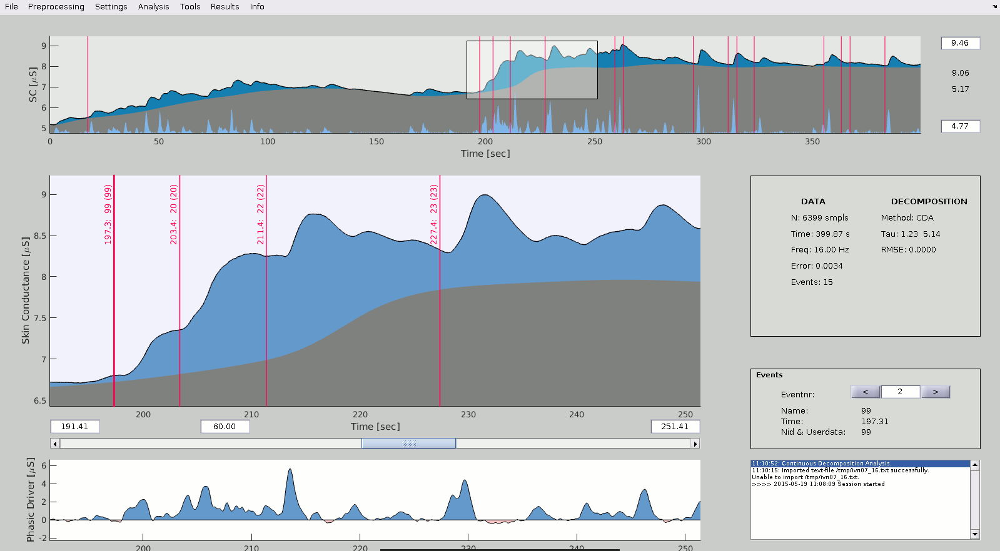

Ledalab...
==========

- is a Matlab-based software for the analysis of skin conductance data (SC; i.e., EDA, GSR).
- can import various file formats (including BioPac, Biotrace, CassyLab, PortiLab, PsychLab, VarioPort, VisionAnalyzer, VitaPort) and provides many preprocessing functions.
- performs event-related analysis relative to events/marker and returns various parameters of phasic and tonic activity.
- can be used via an interactive GUI or in an efficient batch-mode via the Matlab command window.
- currently provides two EDA analysis methods:
    1. The Continuous Decomposition Analysis (CDA) performs a decomposition of SC data into continuous signals of phasic and tonic activity. This method takes advantage from retrieving the signal characteristics of the underlying sudomotor nerve activity (SNA). It is beneficial for all analyses aiming at unbiased scores of phasic and tonic activity.
    2. The Discrete Decomposition Analysis (DDA) perfroms a decomposition of SC data into distinct phasic components and a tonic component by means of Nonnegative Deconvolution. This method is especially advantageous for the study of the SCR shape.
- has been used at more than 60 universities and research facilities (including Aachen, Atlanta, Austin, Bangalore, Beijing, Berlin, Bern, Bielefeld, Budapest, Buenos Aires, Coimbra, Cornell, Delft, Dresden, Duisburg, Eindhoven, Florida, Freiburg, Friedburg, Geneva, Georgia, Göttingen, Graz, Hannover, Helsinki, Indiana, Iowa City, Karlsruhe, Kiel, Köln, Lausanne, Lancester, Leipzig, London, Los Angeles, Lübeck, Lyon, Mainz, Mannheim, Minnesota, Montreal, München, Newark, Nijmegen, Nottingham, Novosiborsk, Oldenburg, Osnabrück, Oslo, Rennes, Rostock, Singapore, Stuttgart, Tel Aviv, Trento, Trier, Triest, Tübingen, Twente, Ulm, Utrecht, Warsaw, Washington, Wien, Wuppertal, Zurich).
- has been frequently cited in previous research: [JNM-paper](http://scholar.google.com/scholar?oi=bibs&hl=en&cites=7909248277382214985), [PSYP-paper](http://scholar.google.com/scholar?oi=bibs&hl=en&cites=15063255836422843469)
- is licensed under the GNU General Public License.

Documentation
=============

The full documentation is available at the [main Ledalab-site](http://ledalab.de)
